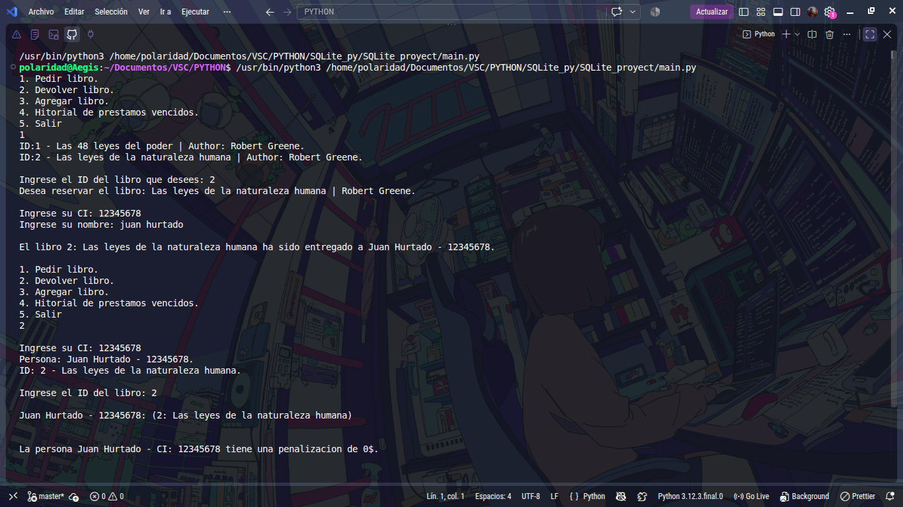

# Sistema de gestión de préstamos para biblioteca, con control de multas y concurrencia segura vía transacciones SQL.

Un sistema pequeño de pedidos y retorno de préstamoss de libros de una biblioteca en consola con **python** integrando **POO, modulos, SQLite**.

# Estado:
> **Incompleto**.

# Pendiente por implementar:
1. Pagar libros.
2. Pool de conexiones.
3. Consulta de historial para personas pendientes.



# Arquitectura:
(por capas)
```text
├── main.py                  # Punto de entrada de la aplicación
├── cli.py                   # Interfaz de línea de comandos (Presentación)
├── database/                # Capa de Persistencia de Datos
│   ├── connect.py           # Creación y definición del esquema SQL
│   └── repo.py              # Patrón Repository (Consultas SQL)
├── models/                  # Dominio y Entidades del Sistema
│   └── logistics.py         # Clases de entidad pura
└── services/                # Capa de Lógica de Negocio
    ├── add_book.py          # Gestión de inventario de libros
    ├── lending_defeated.py  # Control de préstamos vencidos
    ├── lending.py           # Procesamiento de préstamos
    └── return_book.py       # Procesamiento de devoluciones
```

# Decision tecnica:
Un proceso SQL de INSERT o UPDATE para este sistema me llevo a un problema grave: "¿Qué pasa si se va la conexion en medio de un proceso de insercion o actualizacion?", si sucedia algo asi habría datos guardados a medias, o incluso peor y de alli se me ocurrió no abrir la conexion desde el repo, sino desde el mismo procedimiento completo pasandole el cursor a cada uno y que ejecute un commit al finalizar al mismo cursor, y por si algo se sale se control, un rollback para seguridad.

**Manejo de transacciones atomicas(ACID):** Para evitar la corrupción de datos ante una caída de conexión o fallo inesperado durante operaciones compuestas (ej. registrar préstamo + decrementar stock), la conexión no se gestiona de forma aislada en el repositorio. Se pasa el cursor activo a lo largo de todo el procedimiento, ejecutando un commit() únicamente al finalizar con éxito. En caso de error, un bloque try/except ejecuta un rollback() automático para garantizar la integridad de la base de datos.

**Inyeccion de dependencias:** Permite desacoplar la capa de negocio de la persistencia de datos. En lugar de instanciar el repositorio dentro de cada servicio, este se inyecta como dependencia, facilitando la mantenibilidad, legibilidad del código y futuras pruebas unitarias.

# Funcionalidad:
**Base de Datos Local (SQLite3):** Almacenamiento embebido de toda la información en el entorno local. (Para entornos de producción con alta concurrencia, la arquitectura está preparada para migrar a PostgreSQL).

**Gestión de Préstamos:** Asignación de libros a usuarios con registro temporal y actualización automática de stock.

**Control de Devoluciones:** Procesamiento de retornos vinculando el historial del usuario.

**Cálculo de Penalizaciones:** Identificación automática de usuarios con entregas fuera del tiempo límite y cálculo de días de mora.

**Gestión de Inventario:** Registro e integración de nuevos títulos y autores en la base de datos.

**Auditoría de Fechas:** Rastreo preciso de fecha/hora de salida, fecha/hora límite de entrega y fecha/hora real de devolución mediante el módulo datetime.

# Tecnologias:
**Lenguaje**: Python.
**Modulos nativos**: `logging`, `datetime`, `sqlite3`.

# Autor:
**Juan José Hurtado** - [Mi perfil de github](https://github.com/juanjosehurtadohurtado03-lab)